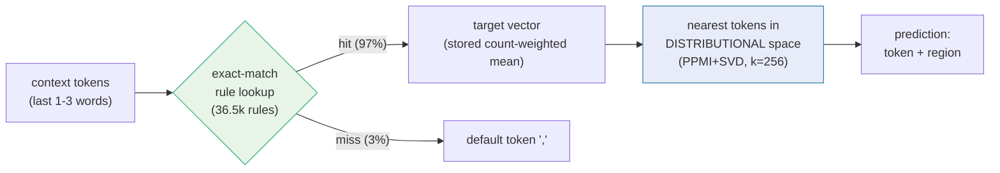
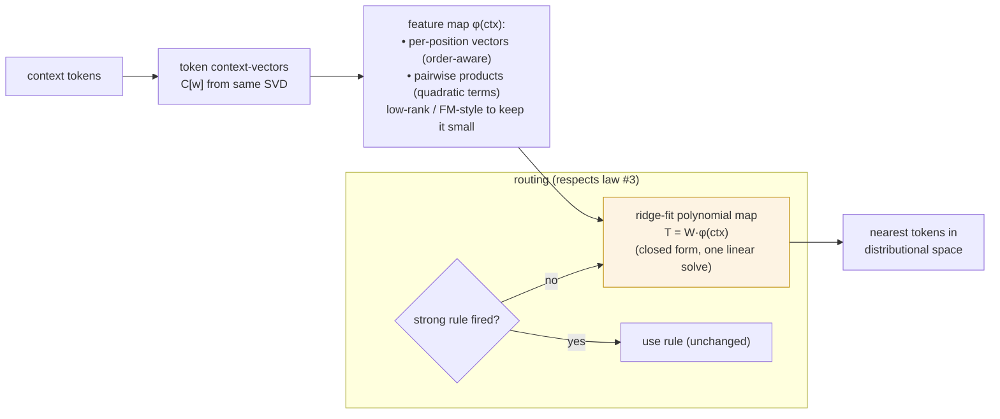
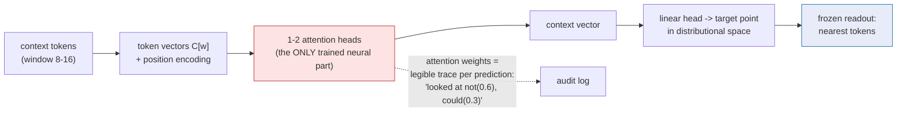
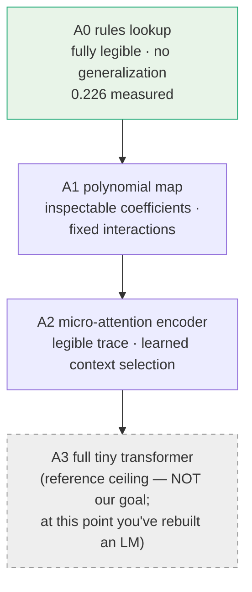

# Alternative Context Architectures — Plan

Goal unchanged: **rule-based / legible code that predicts where the next token
lands in our embedding space.** This plan upgrades the *context side* only.
The readout side (nearest tokens to a target vector in the distributional
space) stays fixed — it works and it's inspectable.

## Why the context side is the bottleneck (measured)

- Rules are exact-match lookups: 97% coverage on in-domain text, but every
  unmatched or thin context falls off a cliff (geometric fallback lost to
  predicting `,`).
- Our only context *representation* so far is a recency-weighted **mean** of
  token vectors — linear, order-insensitive, no interactions. `not` next to
  `great` cannot flip anything in a mean.
- Established laws this plan must respect:
  1. **Post-hoc re-rankers lose** (8/8 failures). Anything new must be a
     *trained conditioning path*, not a correction on top of rule output.
  2. **Two spaces, two jobs.** Prediction targets live in the distributional
     (PPMI+SVD) space; qwen space is for meaning/tone only.
  3. **When a strong rule fires, frequency order wins.** New machinery earns
     its keep on *weak/no-rule* positions first.

## Current architecture (A0)

*Status: token 0.226 / vector 0.213, top-10 0.408 (600k in-domain).* The
lookup is a piecewise-constant function with 36.5k pieces and no ability to
interpolate between pieces.

## A1 — Polynomial context map (closed-form, no SGD)

Replace the lookup **for weak/no-rule positions** with a fitted polynomial
function from context embedding to target vector.

- **What the quadratic terms buy:** interactions between context positions —
  the mean can't represent `(not, great) ≠ (great, not)`; products can.
- **Legibility:** coefficients are inspectable per feature; the map is one
  matrix, auditable like a rule table with graded entries.
- **Cost:** numpy only. Features via low-rank projection of pairwise products
  (factorization-machine trick) to ~2–4k dims; ridge solve over 600k examples
  is a single normal-equations pass.
- **Falsifiable prediction:** beats the current default/backoff on weak- and
  no-rule positions; roughly ties strong rules elsewhere. If it can't beat
  `,` on cliff positions, polynomials over these embeddings don't carry
  enough signal — kill it.

## A2 — Micro-attention context encoder (neural, quarantined)

One small attention layer whose **only job is context identification**:
which past tokens matter and how to mix them into a context vector. The
readout stays frozen (nearest neighbors in the distributional space), so the
neural part is a sealed module with a legible interface on both sides.

- **Why attention specifically:** it's the minimal mechanism for *content-
  dependent* context selection — the thing neither rules, means, nor
  polynomials do (they weight positions, not meanings).
- **Legibility contract:** the weights ARE the explanation. Every prediction
  ships with "which context tokens it attended to." The black box is one
  layer thick, with named vectors on both sides.
- **Cost:** a single-head numpy implementation with SGD is feasible at 256-d
  over 600k tokens; torch would be easier if we allow it.
- **Falsifiable prediction:** if attention only rediscovers recency weights
  (uniform-ish attention), A1 ties it and we keep the simpler model. It earns
  its place only by beating A1 specifically on long-range-context positions
  (pronoun/name recurrence, quote-state — things we know exist in the data).

## The ladder (where each sits)

Each rung trades a measured amount of legibility for a measured amount of
generalization. We climb only while the accuracy-per-legibility trade is
worth it, and A3 is listed only as the ceiling to compare against.

## Experimental protocol (same discipline as always)

1. Corpus: ministral 1.2M (factory v2, diversified prompts), **dedup +
   doc-level split** (dedup.py) — train/val/test 80/10/10.
2. Metrics: exact top-1, top-10 recall, distinct-preds; reported **overall**
   and **bucketed** by rule strength (strong rule / weak rule / no rule) so we
   see exactly where each architecture pays.
3. Order: A1 first (cheap, closed-form). A2 only if A1 leaves visible headroom
   on long-context buckets. Val-tuned, one-shot test, McNemar on deltas.
4. Honest kill criteria pre-registered per rung (see falsifiable predictions).

## Milestones

- [x] M1: bucketed baseline (652k-token corpus, doc-split, dedup-clean):
      strong(50+)=0.203, **med(10-49)=0.240 (best bucket)**, thin(3-9)=0.209,
      none=0.100 (2.8% of positions), overall 0.212. Value concentrates in the
      mid-band: specific-but-attested contexts.
- [x] M2: A1 polynomial map — **KILLED per pre-registered criterion.**
      Beat default on no-rule (0.116 vs 0.100) but LOST thin bucket
      (0.173 vs 0.209). Best-case routing gain +0.0004 overall. Law sharpened:
      a 3-observation exact-match rule beats a quadratic map fit on 640k
      examples — memorization dominates smooth approximation at this scale.
- [x] M3: decision — **no-go on A2 for accuracy** (open headroom = 2.8% of
      positions × small delta). A2 remains justifiable only as a long-range
      context study, not as an accuracy play. Ladder closed at A0 for this
      corpus scale; revisit only if corpus grows 10x or task changes.
- [ ] M4: (parked) A2 micro-attention as long-range study
- [ ] M5: (superseded) ladder summary is M1-M3 above
